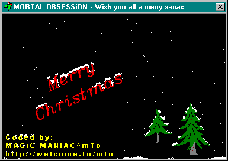



## Snow Fall Example

### Description

This simulate a snow fall with layout designed for christmas, Include with funny sounds. The snow falls on the ground, text and trees and even falls of the snow, text and trees. It's a very good simulation I think. If you can do it better then proof it! Send your snow simulation to me. Now check this code, and vote it on www.planet-source-code.com for free-use without any credit in your application...
 
### More Info
 

             |
---                |---
**Submitted On**   |2000-12-06 20:52:54
**By**             |[MAGiC MANiAC^mTo](https://github.com/Planet-Source-Code/PSCIndex/blob/master/ByAuthor/magic-maniac-mto.md)
**Level**          |Beginner
**User Rating**    |4.3 (34 globes from 8 users)
**Compatibility**  |VB 6\.0
**Category**       |[Graphics](https://github.com/Planet-Source-Code/PSCIndex/blob/master/ByCategory/graphics__1-46.md)
**World**          |[Visual Basic](https://github.com/Planet-Source-Code/PSCIndex/blob/master/ByWorld/visual-basic.md)
**Archive File**   |[CODE\_UPLOAD123941262000\.zip](https://github.com/Planet-Source-Code/magic-maniac-mto-snow-fall-example__1-13374/archive/master.zip)

